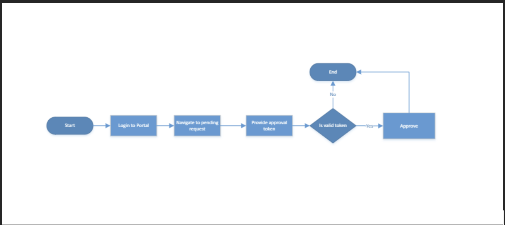

# Approval Module

## Process

1. The user navigates to approval request page and clicks on pending request.

2. The user selects and clicks on approve on the pending request table action column.

3. The user is requested to enter the approval token and click on submit.

4. Based on the approval setup, if the user is the only approver, the instruction eill be approved.

5. If other approvers are required, they will go through the dame flow listed above to approve the instruction.
