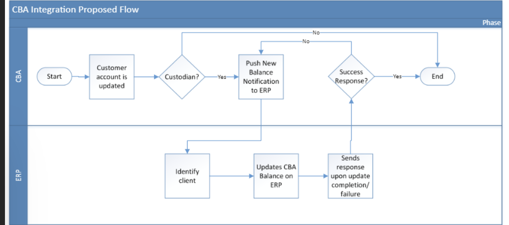

# CBA Integration

## Process

1. To integrate the client’s core banking application to ERP, the ERP checks of the client is updated and is the custodian of the account.

2. If all checks are valid, the CBA will update the clients CBA balance on the ERP.

3. The portal at different intervals handshakes with the ERP to update its CBA balance with the ERP.
