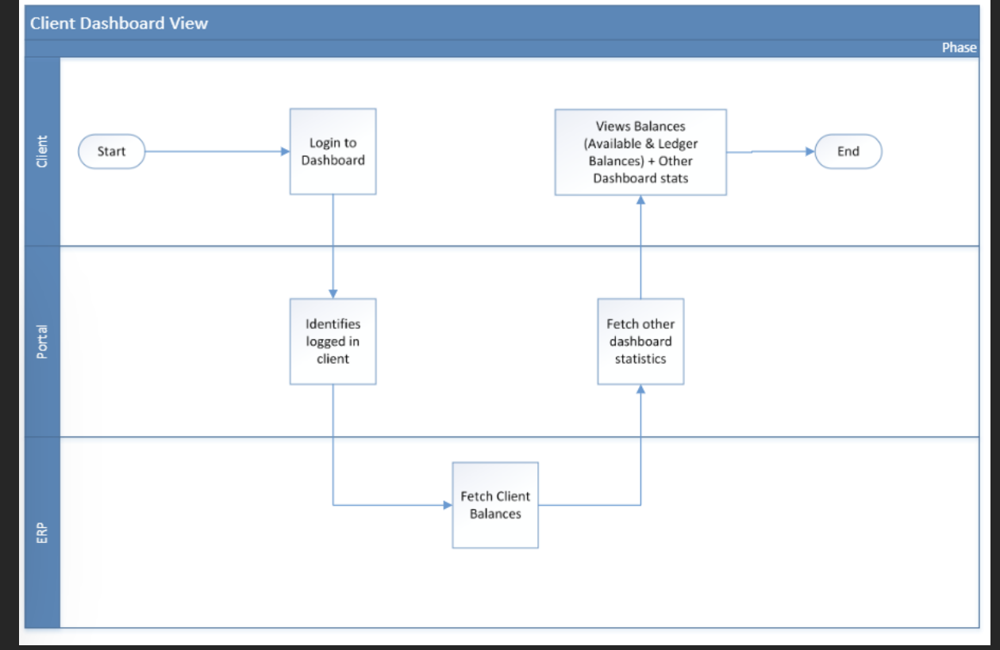

# Dashboard

## Process

The client logs into the portal and sees a statistic of;

- Open instructions.

- Posted instructions.

- Total instructions

- Cash balance from ERP.

And a table showing list of recently created instructions.
