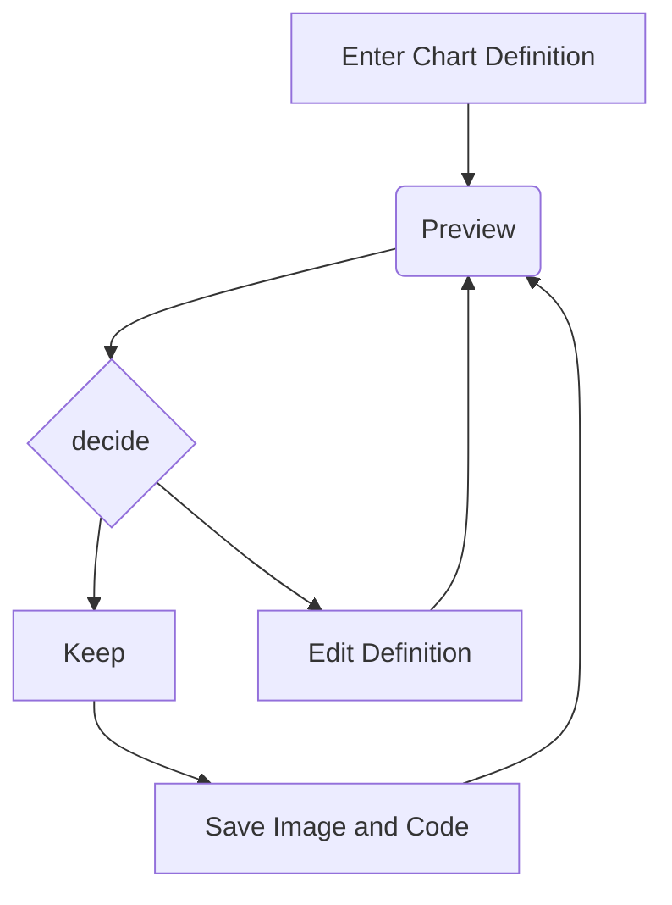

# Report Module

1. The client selects the report to be generated, (portfolio valuation -PVR and lien bill report).

2. If the clients select PVR, the client will provide the client code, the valuation start and end date and then click on submit.

3. The portal generates the report based on the specified date range with timestamp.

4. If the client selects lien, the client will provide the client code and submit.

5. The portal will also generate the lien report with timestamp and supporting chart (pie chart).

