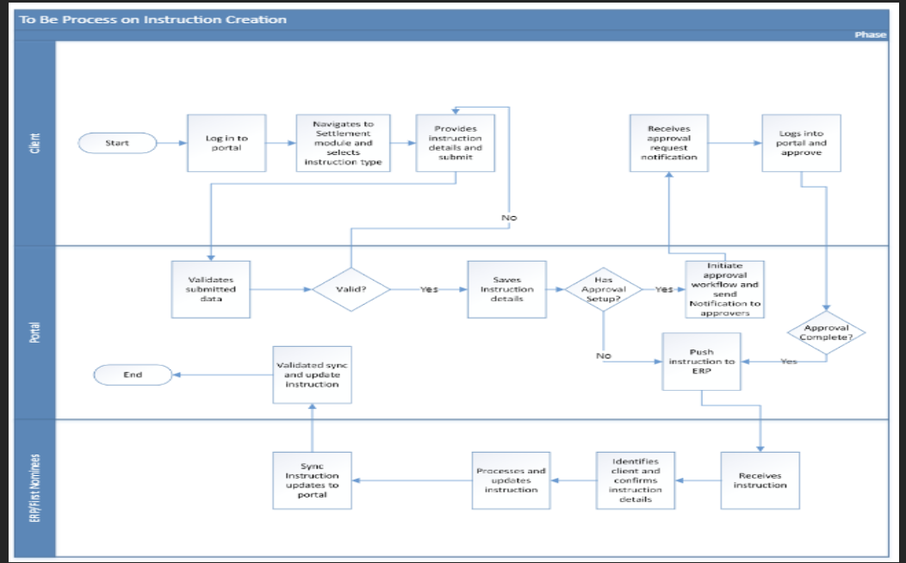

# Settlement Module

## Process

1. The client logs into the portal with exiting email and password.

2. The client navigates to settlement module and selects instruction type.  

3. The client provides necessary instruction details and submit.

4. If instruction has approval setup, the approver workflow is initiated and the necessary approvers will be notified.  

5. After approval the instruction is pushed to ERP.  

:::warning
If the instruction does not have approval setup, the instruction is pushed to ERP.

The user processes and updates the instruction and then sync the instruction to portal.
:::
