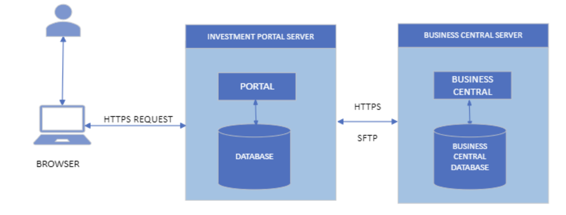

# Architecture

From the system architecture, the clients can access the Investment portal via browsers which can be on a mobile phone, tablets, and/or PC. They access the portal via the portal’s URL where their credentials (Email and Password) are required to authenticate them into the system. Requests between the client’s browser and the portal are sent over HTTPS.

The communication between the Portal Server and the Business Central server is Bi-directional over HTTPS and SFTP. The established SFTP communications between these servers aids report download and instructions’ supporting documents transfers between these servers.

The Dynamics Business central is the back office of the Investment portal and this implies that the primary source of data available on the Portal is from the Dynamics Business central.

The HTTPS communications are channeled through APIs and Web services deployed on the respective servers. Requests from the Portal to Business central are sent via Web Services published on the Dynamics Business central whereas requests from Dynamics Business central to the Portal are sent via the APIs published on the portal.

Either of these services on the respective servers are secured by authentication key, tokens and credentials, which implies that all requests are authenticated before it’s acknowledged within either of the servers.
